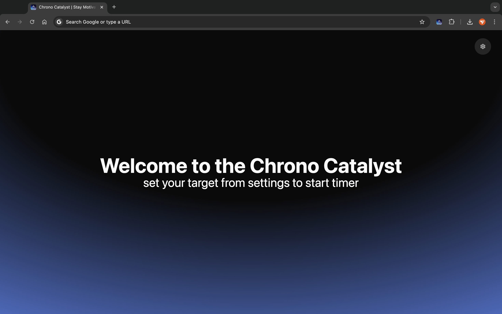
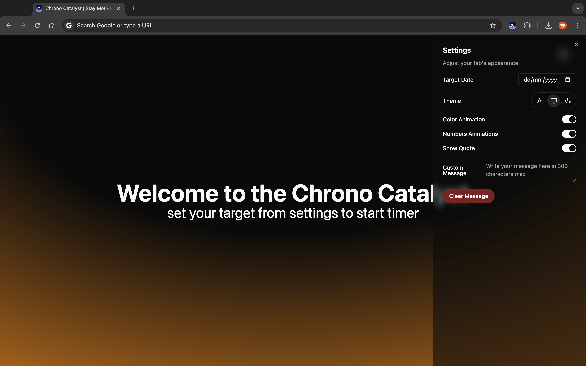

# Chrono Catalyst


Chrono Catalyst is an open-source project designed to help you stay motivated by setting a target date and providing a countdown to achieve your goals. This project leverages modern web technologies and libraries to deliver a seamless user experience.

## Screenshots

Here are some screenshots of Chrono Catalyst in action:

### Welcome Screen



### Settings Sidebar



### Countdown Screen


## Features

- Set a target date and view a countdown to that date.
- Customize the appearance and behavior of the countdown.
- Responsive design for use on various devices.
- Integration with popular UI libraries like Radix UI and Tailwind CSS.

## Installation

To get started with Chrono Catalyst, follow these steps:

1. **Clone the repository:**

   ```bash
   git clone https://github.com/sahilverma-dev/Chrono-Catalyst.git
   cd Chrono-Catalyst
   ```

2. **Install dependencies:**

   ```bash
   npm install
   ```

3. **Run the development server:**

   ```bash
   npm run dev
   ```

4. **Build for production:**

   ```bash
   npm run build
   ```

5. **Preview the production build:**

   ```bash
   npm run preview
   ```

6. **Build and import the dist folder to Chrome:**

   After building the project for production, you can use the custom build in Chrome by following these steps:

   1. **Open Chrome and go to the Extensions page:**

      ```bash
      chrome://extensions/
      ```

   2. **Enable Developer mode** by clicking the toggle switch in the top right corner.

   3. **Click the "Load unpacked" button** and select the `dist` folder from your project directory. This will load your custom build as a Chrome extension.

   Now you can use your custom build of Chrono Catalyst directly in Chrome.

## Usage

Once you have the development server running, you can access the application in your web browser at `http://localhost:3000`. From there, you can set your target date and start using the countdown features.

## Contributing

We welcome contributions from the community! If you would like to contribute to Chrono Catalyst, please follow these steps:

1. **Fork the repository.**
2. **Create a new branch for your feature or bugfix:**

   ```bash
   git checkout -b my-feature-branch
   ```

3. **Make your changes and commit them:**

   ```bash
   git commit -m "Description of my changes"
   ```

4. **Push your changes to your fork:**

   ```bash
   git push origin my-feature-branch
   ```

5. **Create a pull request to the main repository.**
6. **Build and import the dist folder to Chrome:**

   After building the project for production, you can use the custom build in Chrome by following these steps:

   1. **Open Chrome and go to the Extensions page:**

      ```bash
      chrome://extensions/
      ```

   2. **Enable Developer mode** by clicking the toggle switch in the top right corner.

   3. **Click the "Load unpacked" button** and select the `dist` folder from your project directory. This will load your custom build as a Chrome extension.

   Now you can use your custom build of Chrono Catalyst directly in Chrome.

## License

Chrono Catalyst is licensed under the MIT License. See the [LICENSE](LICENSE) file for more information.

## Acknowledgements

This project uses the following open-source libraries and tools:

- [React](https://reactjs.org/)
- [Radix UI](https://www.radix-ui.com/)
- [Tailwind CSS](https://tailwindcss.com/)
- [Lucide React](https://lucide.dev/)
- [Class Variance Authority](https://cva.style/)

## Contact

For any questions or feedback, please open an issue on the [GitHub repository](https://github.com/sahilverma-dev/Chrono-Catalyst) or contact the project maintainer.

- **Email:** [sahilverma.webdev@gmail.com](mailto:sahilverma.webdev@gmail.com)
- **Portfolio:** [sahilverma.dev](https://sahilverma.dev/)
- **GitHub:** [@sahilverma-dev](https://github.com/sahilverma-dev)
- **Twitter:** [@sahilverma_dev](https://twitter.com/sahilverma_dev)
- **LinkedIn:** [sahilverma-dev](https://www.linkedin.com/in/sahilverma-dev/)
